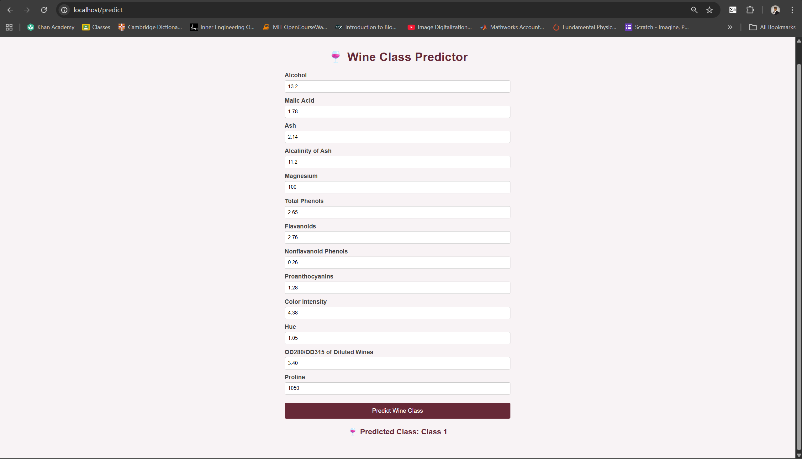

# Docker Lab 2 — Wine Classifier with TensorFlow + Flask

## Overview

This lab demonstrates a multi-stage Docker build that:
1. **Trains** a TensorFlow neural network on the UCI Wine dataset
2. **Serves** predictions via a Flask web app with an HTML form UI

The original lab used the Iris dataset with a 2-layer neural network. This version swaps in the **Wine Quality dataset** (13 features, 3 classes) and expands the network architecture for better performance.

---

## Changes from Original

| Component | Original | Modified |
|---|---|---|
| Dataset | Iris (4 features, 3 classes) | Wine Quality (13 features, 3 classes) |
| Model architecture | 2 Dense layers (8 units) | 3 Dense layers (64 → 32 → 3 units) |
| Training epochs | 50 | 100 |
| Flask port | 4000 (mismatched) | 80 (fixed) |
| UI | 4 input fields | 13 input fields with placeholders |

---

## Project Structure

```
Lab2/
├── dockerfile                  # Multi-stage build (train + serve)
├── docker-compose.yml          # Two services: model_training + serving
├── requirements.txt            # Dependencies
├── HOWTO                       # Quick reference
└── src/
    ├── model_training.py       # Trains TF neural net, saves my_model.keras
    ├── main.py                 # Flask server — serves predictions on port 80
    └── templates/
        └── predict.html        # HTML form with 13 wine feature inputs
```

---
## Demo


---

## How to Run

Make sure Docker Desktop is running, then:

```bash
docker-compose up --build
```

Once both containers are up, open your browser at:

```
http://localhost:80/predict
```

Fill in the 13 wine chemical features and click **Predict Wine Class**.

---

## Sample Input

| Feature | Example Value |
|---|---|
| Alcohol | 13.2 |
| Malic Acid | 1.78 |
| Ash | 2.14 |
| Alcalinity of Ash | 11.2 |
| Magnesium | 100.0 |
| Total Phenols | 2.65 |
| Flavanoids | 2.76 |
| Nonflavanoid Phenols | 0.26 |
| Proanthocyanins | 1.28 |
| Color Intensity | 4.38 |
| Hue | 1.05 |
| OD280/OD315 | 3.40 |
| Proline | 1050.0 |

---

## How it Works

```
Stage 1 (model_training):
  Wine dataset → StandardScaler → TF Neural Net (64→32→3) → my_model.keras

Stage 2 (serving):
  my_model.keras → Flask app → /predict endpoint → predict.html UI
```

The multi-stage Dockerfile keeps the serving image lean by only copying the trained model file from Stage 1 — the training dependencies are not included in the final image.